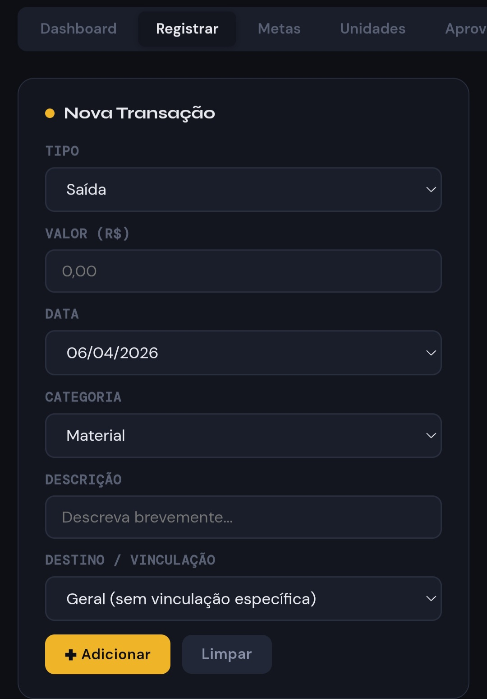

<div align="center">
  <!-- Substitua o link abaixo pela sua logo ou banner do projeto -->
  

  <h1>Guerreiros do Alto · Dashboard Financeira</h1>
  <p>
    Um sistema de gestão financeira reativo, moderno e em tempo real construído para o controle de caixa do clube de desbravadores. 
  </p>

  <!-- Badges -->
  <p>
    
    
    
    
  </p>

  <h3>
    <a href="https://gdaciaxa.page/">Live Demo</a>
    <span> | </span>
    <a href="#-sobre-o-projeto">Sobre</a>
    <span> | </span>
    <a href="#-features">Features</a>
    <span> | </span>
    <a href="#-tecnologias">Tecnologias</a>
  </h3>
</div>

<br>

## 📖 Sobre o Projeto

O **GDACaixa** (Guerreiros do Alto Caixa) foi desenvolvido do zero para digitalizar e simplificar a gestão e o fluxo de caixa. O sistema opera de forma independente com arquitetura *Backend-Free*, processando as regras de negócio inteiramente no Front-End e armazenando os dados em tempo real na nuvem através do Google Firebase.

O projeto soluciona problemas reais de administração financeira, dividindo o ecossistema em três módulos principais:
1. **Clube:** Visão geral das transações principais (mensalidades, doações).
2. **Doceria:** Controle de vendas de alimentos, custos das mercadorias e projeção do lucro.
3. **Vendas Rápidas / Eventos:** Controle de comissionamento de vendas baseados no plano e hierarquia definida.

---

## ✨ Features Principais

- **📊 Dashboard Interativo:** Gráficos responsivos (Chart.js) para análise de métricas como faturamento e comparativo de despesas/receitas mensais.
- **🔐 RBAC (Controle de Acesso por Papel):** O sistema isola informações dinamicamente baseando-se no papel do usuário autenticado:
  - `Admin`: Acesso e controle total do sistema (Logs, deleção, edição).
  - `Diretor`: Acesso gerencial com visualização completa de relatórios.
  - `Conselheiro`: Visualização focada de sua base e registro pontual de vendas.
  - `Desbravador`: Acesso estritamente bloqueado para leitura em fluxos que não os pertencem.
- **☁️ Sincronização em Tempo Real:** Conexão imutável de estado via Cloud Firestore.
- **📱 Design Responsivo e "Glassmorphism":** UI rica, modo escuro embutido nativamente e adaptação a qualquer resolução de tela (Mobile-First).
- **📝 Exportação Multi-Módulo:** Capacidade de extrair transações consolidadas de modo offline para conferência.

---

## 📸 Screenshots

Aqui você pode mostrar o sistema funcionando. Tire prints bonitos das telas e altere os links abaixo.

| Dashboard Principal | Fluxo de Cadastro |
| :---: | :---: |
|  |  |
| *Gráficos dinâmicos e controle de caixa* | *Layout mobile first focado na experiência de quem usa na rua* |

*(Dica: Substitua as imagens acima fazendo upload dos prints para a própria pasta do GitHub ou na issue, e colando o link raw aqui na tag src)*

---

## 🚀 Como Executar Localmente

Sendo uma aplicação estática (SPA), a execução é extremamente simples, não necessitando de Node.js, Python ou qualquer servidor complexo instalado na sua máquina.

1. **Clone o repositório:**
   ```bash
   git clone https://github.com/SEU-USUARIO/GDACaixa.git
   ```

2. **Acesse o diretório:**
   ```bash
   cd GDACaixa
   ```

3. **Configure as Variáveis de Ambiente do Firebase:**
   Como medida de segurança e boas práticas (*Secret Scanning GitHub*), as credenciais de API do projeto real não estão expostas no HTML. Para rodar sua instância:
   - Crie um projeto no Google Firebase.
   - Substitua as chaves fracionadas (`k1`, `k2`, `k3`) em `index.html` pelas suas chaves geradas pelo console do Google Cloud.

4. **Inicie o Servidor Local:**
   Basta rodar a página com o [Live Server](https://marketplace.visualstudio.com/items?itemName=ritwickdey.LiveServer) (extensão do VS Code) ou similar.

---

## 🛠 Tecnologias

As seguintes ferramentas foram usadas na construção do projeto:

- **HTML5 & CSS3 Vanilla**: Maximização da performance através da não utilização de pesados pacotes de CSS (Sem Tailwind/Bootstrap - todo o CSS e Design System foi criado do zero).
- **JavaScript (ES6+)**: Controle de estados (`APP`), renderizações parciais condicionais do DOM e eventos.
- **Firebase**: 
  - `Firestore Database`: Banco de dados NoSQL.
  - *(Futuro)* `Firebase Authentication`: Infraestrutura de login e acesso.
- **Chart.js**: Biblioteca externa injetada via CDN construindo o escopo analítico.
- **GitHub Pages**: Plataforma CI/CD e hospedagem de edge na web.

---

## 🧑‍💻 Autor


<br />
<sub><b>Wallyson</b></sub>
<br />

Feito com raciocínio analítico, muito código e paciência ☕. Entre em contato!

[](https://www.linkedin.com/in/seu_user_aqui/)

---
<div align="center">
  <small>Projeto protegido sob a licença MIT - 2026</small>
</div>
